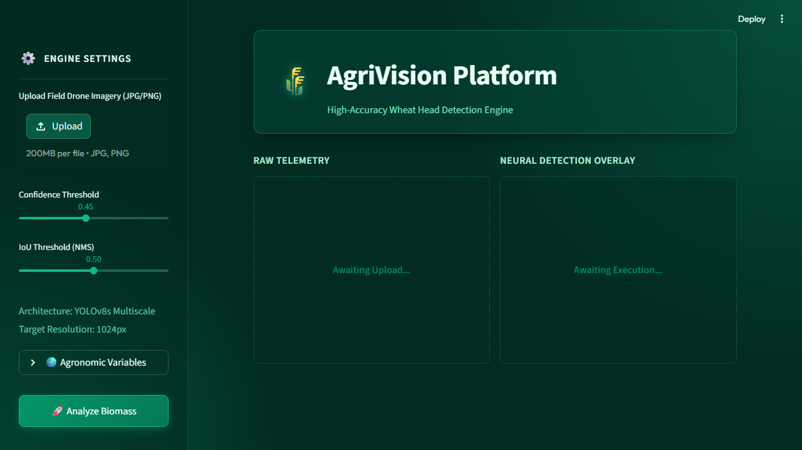

# CropSense Decision Support System
### High-Precision Computer Vision for Agronomic Intelligence


 
 


---

### 🚀 Engineering Deployment & Live Documentation

| Resource | Description | Action |
| :--- | :--- | :--- |
| **Production Inference Engine** | Live YOLOv8 pipeline hosted on Hugging Face Space. | [**Run Live Demo**](https://huggingface.co/spaces/Anahit-Israelyan/CropSense-Engine) |
| **Research Foundations** | Comprehensive study and model breakdown. | [**Read Research Paper**](https://github.com/Anahit-Israelyan/CropSense-dashboard/blob/main/CropSense_Paper/CropSense_CVPR_Draft.pdf) |

---

## 📸 Visual Preview

<p align="center">
  
</p>
<p align="center"><em>Real-time wheat head detection & automated agronomic analytics (Yield estimation, Spatial Uniformity, and Revenue projection)</em></p>

---

## Executive Summary

The CropSense Decision Support System introduces a modern, automated computer vision approach to agricultural monitoring, moving away from slow and error-prone manual crop assessments. By analyzing high-resolution aerial imagery taken by drones, this project utilizes a custom-trained YOLOv8 neural network to accurately identify and count wheat heads across diverse field conditions. This provides farmers with precise, actionable data at a scale that human inspection simply cannot match.

Beyond basic object detection, CropSense translates visual data into concrete business intelligence. The system aggregates the detected wheat heads and combines them with localized agronomic variables (like Thousand Grain Weight) to estimate total crop yield, evaluate field uniformity, and project potential revenue. These insights are instantly compiled into a comprehensive PDF report, giving farm managers the data they need to make informed decisions rapidly.

## System Architecture & Problem Domain

### The Challenge
Modern agriculture still relies heavily on manual sampling to estimate yields and detect crop stress. This process is incredibly slow, difficult to scale, and statistically unreliable due to human error and dense field growth. Without accurate, large-scale spatial data, farm operators are forced to make macro-level decisions based on micro-level observations, leading to inaccurate harvest forecasts and missed opportunities to correct localized crop issues.

### The Solution
CropSense solves this by automating the data collection and analysis pipeline. Built upon the robust Global Wheat Dataset, our fine-tuned YOLOv8 model is capable of identifying wheat traits under various lighting conditions and overlapping canopies.

The pipeline operates in the following stages:
1. **Data Intake**: High-resolution drone imagery is uploaded into the dashboard.
2. **Neural Processing**: The YOLOv8 model scans the imagery, extracting spatial features to pinpoint individual wheat heads.
3. **Refinement (NMS)**: Strict Non-Maximum Suppression (NMS) algorithms ensure that overlapping detections are filtered out, guaranteeing an accurate absolute count.
4. **Agronomic Calculations**: The raw counting data is processed through our analytics engine, merging with regional constants to compute critical Key Performance Indicators (KPIs).
5. **Presentation**: Results are displayed dynamically on the Streamlit dashboard and can be exported as a professional PDF briefing for stakeholders.

---

## 🏗️ Project Structure

```
CropSense-dashboard/
├── app.py                          # Streamlit dashboard application
├── style.css                       # Emerald Glassmorphism UI stylesheet
├── requirements.txt                # Python dependencies
│
├── src/                            # Backend logic
│   ├── config.py                   # Regional agronomic variables
│   ├── analytics.py                # Yield & revenue calculations
│   ├── inference.py                # YOLOv8 execution engine
│   ├── report.py                   # PDF generation (FPDF)
│   ├── dataset.py                  # Data prep tools
│   └── utils.py                    # Helper functions
│
├── scripts/                        # Diagnostics and utilities
│   ├── train.py                    # Training initialization
│   └── evaluate_model.py           # Precision/Recall analysis
│
├── notebooks/                      # Jupyter research environment
│   └── 01_Basic_EDA.ipynb          # Exploratory Data Analysis
│
├── configs/                        # YAML model configurations
├── data/                           # Local datasets (gitignored)
├── tests/                          # Unit testing suite
├── outputs/                        # Model weights & logs (gitignored)
├── CropSense_Paper/               # Research paper drafts
└── LICENSE                         # MIT License
```

---

## Agronomic Analytics Engine

The core value of CropSense is its ability to turn pictures into actionable farming metrics.

| Metric | Calculation Method | Practical Value |
| :--- | :--- | :--- |
| **Spatial Uniformity (CV%)** | Calculates the Coefficient of Variation across the field. | Acts as a health indicator. Low CV% means consistent growth; high CV% points to localized stress or seeding issues. |
| **Estimated Yield (t/ha)** | Multiplies detection density by regional grain weight constants. | Allows for accurate, large-scale harvest forecasting based on hard visual data. |
| **Projected Revenue** | Combines the estimated yield with current market commodity prices. | Provides immediate financial projections to assist in budget planning and market strategy. |

### PDF Briefing Export
Once the analysis is complete, the application generates a comprehensive PDF report entirely in-memory using `fpdf2`. This ensures that sensitive farm data isn't saved to disk and allows for instantaneous downloading directly from the dashboard interface.

---

## 📊 Model Performance & Validation

The model was heavily tuned and validated to prioritize high-confidence predictions, reducing "hallucinations" (false positives) that could artificially inflate yield estimates. 

By pushing the YOLOv8s architecture through extended hyperparameter optimization, the tuned model achieved a **+39.4% increase in median prediction confidence** compared to the baseline. In the context of precision agriculture, ensuring that every detected object is genuinely a wheat head is vastly more important than capturing every possible blurry artifact, making this model highly robust for real-world deployment.

---

## Developer Guide: Local Deployment

To run this project on your own machine, follow these setup instructions. (Requires Python 3.11+)

### 1. Clone the Repository
```bash
git clone https://github.com/Anahit-Israelyan/CropSense-dashboard.git
cd CropSense-dashboard
```

### 2. Environment Setup
Create and activate a virtual environment to isolate dependencies.

**Windows:**
```powershell
python -m venv venv311
.\venv311\Scripts\Activate.ps1
```

**Linux / macOS:**
```bash
python3 -m venv venv311
source venv311/bin/activate
```

### 3. Install Dependencies
```bash
pip install -r requirements.txt
```

### 4. Run the Dashboard
```bash
streamlit run app.py
```

---

## Future Roadmap

Looking ahead, we plan to expand the CropSense platform in several key areas:
1. **Multi-Spectral Analysis:** Adding support for NDVI data to directly measure chlorophyll density and biological crop health.
2. **Disease Identification:** Training the model to recognize distinct phenotypic disease markers (such as wheat rust).
3. **API Detachment:** Rebuilding the inference engine as a standalone FastAPI service to allow mobile apps and IoT devices to utilize the model remotely.

---

## 📄 Citation

If you use this work in your research, please cite:

```bibtex
@misc{israelyan2026CropSense,
  title        = {CropSense: Computer Vision Strategies for Wheat Head Detection},
  author       = {Israelyan, Anahit},
  year         = {2026},
  howpublished = {\url{https://github.com/Anahit-Israelyan/CropSense-dashboard}}
}
```

---

## 🧑‍💻 Author

**Anahit Israelyan**  

[](https://github.com/Anahit-Israelyan)
[](https://linkedin.com/in/anahit-israelyan)

---

## License

This project is open-source and released under the **[MIT License](LICENSE)**. 